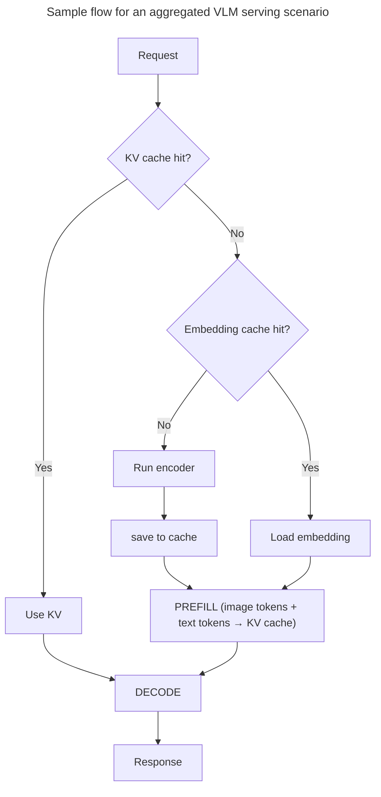

Dynamo supports multimodal inference across multiple LLM backends, enabling models to process images, video, and audio alongside text.

> [!WARNING]
> Multimodal processing must be explicitly enabled at startup. See the relevant backend documentation ([vLLM](multimodal-vllm.md), [SGLang](multimodal-sglang.md), [TRT-LLM](multimodal-trtllm.md)) for the necessary flags. This prevents unintended processing of multimodal data from untrusted sources.

## Key Features

Dynamo provides support for improving latency and throughput for vision-and-language workloads through the following features, that can be used together or separately, depending on your workload characteristics:
| Feature | Description |
|---------|-------------|
| **[Embedding Cache](embedding-cache.md)** | CPU-side LRU cache that skips re-encoding repeated images |
| **[Encoder Disaggregation](encoder-disaggregation.md)** | Separate vision encoder worker for independent scaling |
| **[Custom Vision Encoders](custom-vision-encoder.md)** | In-process author-provided vision towers with cross-request batching |
| **[Multimodal KV Routing](multimodal-kv-routing.md)** | MM-aware KV cache routing for optimal worker selection |

## Support Matrix

| Stack | Image | Video | Audio |
|-------|-------|-------|-------|
| **[vLLM](multimodal-vllm.md)** | ✅ | 🧪  | 🧪 |
| **[TRT-LLM](multimodal-trtllm.md)** | ✅ | ❌ | ❌ |
| **[SGLang](multimodal-sglang.md)** | ✅ | 🧪 | ❌ |

**Status:** ✅ Supported | 🧪 Experimental | ❌ Not supported

## Security: URL Validation

All multimodal loaders route remote fetches through a shared URL policy
(`dynamo.common.multimodal.url_validator`). Only
`https://` and `data:` URLs are allowed by default, private / internal IPs are blocked,
and local file access is disabled. Every HTTP redirect hop is re-validated
against the policy.

Two environment variables loosen the defaults for non-public deployments:

| Variable | Default | Effect |
|----------|---------|--------|
| `DYN_MM_ALLOW_INTERNAL` | `0` | Set to `1` to allow `http://`, private / internal IPs, and explicit ports. Intended for on-prem or local-dev setups where media lives on an internal network. |
| `DYN_MM_LOCAL_PATH` | *(empty)* | Absolute directory prefix. When set, `file://` URIs and bare paths are allowed if they resolve inside this prefix. |

> [!WARNING]
> Never set `DYN_MM_ALLOW_INTERNAL=1` on public-facing deployments. It opens SSRF paths to cloud metadata endpoints (AWS IMDS, GCE, Azure) and other internal services.

## Worker Image Cache

The Python image loader caches successfully decoded RGB images in each worker. The cache is bounded by both entry count and decoded bytes:

| Variable | Default | Effect |
|----------|---------|--------|
| `DYN_MM_IMAGE_CACHE_SIZE` | `1024` | Maximum number of decoded images retained per worker process. |
| `DYN_MM_IMAGE_CACHE_MAX_BYTES` | `536870912` | Maximum decoded pixel bytes retained per worker process. Set to `0` to disable the cache. |

By default, the complete validated URL is the cache key. Signed URL query parameters remain part of that identity, so rotating signatures do not alias automatically.

Set `DYN_MM_TRUST_MEDIA_UUIDS=1` on the Rust frontend to reuse a decoded image across rotating URLs when both of these values are present:

- a nonempty `x-tenant-id` header replaced by a trusted gateway;
- an `image_url.uuid` value supplied by that gateway for the underlying immutable object.

The frontend derives an opaque BLAKE3 key from the tenant, modality, and UUID, then forwards only that key to the worker. Missing UUIDs retain full-URL identity. The identity is reused by the decoded-image cache, vLLM multimodal processor cache, optional split-encoder embedding cache, and multimodal routing. The worker validates every presented URL before reading the decoded-image cache, so a stable identity cannot bypass the Server-Side Request Forgery (SSRF) policy.

To reuse vLLM preprocessing results, configure a nonzero `--mm-processor-cache-gb` value on each vLLM worker. Stable identities still reuse Dynamo's decoded-image and split-encoder caches when the vLLM processor cache is disabled.

For multimodal routing, origins should answer byte-range requests with HTTP 206. If an origin ignores Range and returns HTTP 200, a trusted stable identity permits one full response capped at 10 MiB so the frontend can cache the image dimensions. URL-identity requests retain the 206-only behavior and never buffer a full response for routing.

> [!CAUTION]
> Enable `DYN_MM_TRUST_MEDIA_UUIDS` only when the gateway authorizes access, strips caller-provided `x-tenant-id` and image UUID values, then supplies immutable tenant-scoped identities. A caller who can choose both values could alias another object within that tenant and poison the decoded-image, vLLM processor, encoder, and KV cache layers. Never derive identity by removing or normalizing signed query parameters.

## Example Workflows

Reference implementations for deploying multimodal models:

- [vLLM multimodal examples](https://github.com/ai-dynamo/dynamo/tree/main/examples/backends/vllm/launch) (image, video)
- [TRT-LLM multimodal examples](https://github.com/ai-dynamo/dynamo/tree/main/examples/backends/trtllm/launch)
- [SGLang multimodal examples](https://github.com/ai-dynamo/dynamo/tree/main/examples/backends/sglang/launch)

## Backend Documentation

Detailed deployment guides, configuration, and examples for each backend:

- **[vLLM Multimodal](multimodal-vllm.md)**
- **[TensorRT-LLM Multimodal](multimodal-trtllm.md)**
- **[SGLang Multimodal](multimodal-sglang.md)**
